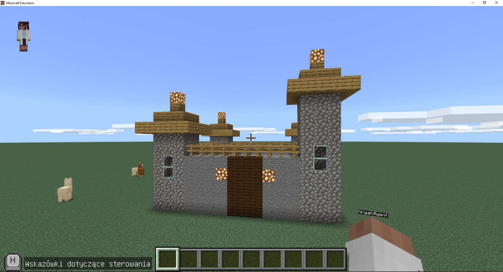
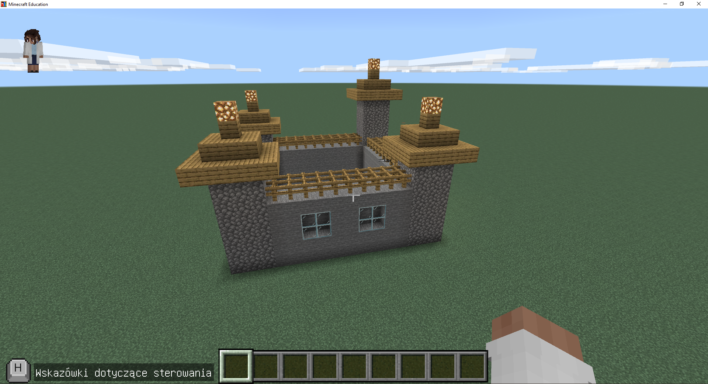
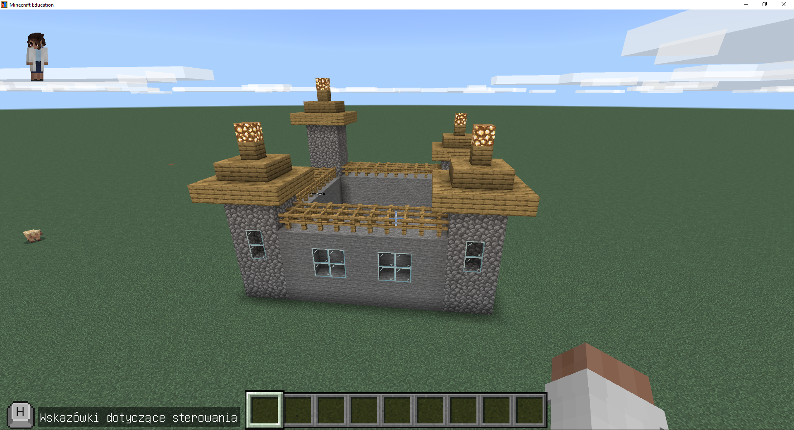

# Game Scripts Laboratory

**Bash - Tic-Tac-Toe**

✅ 3.0 [Link do commita](https://github.com/AgnikAm/GameScriptsLaboratory/commit/5c8778b663e4b3644362580f5113e2c01850b7d6)

✅ 4.0 [Link do commita](https://github.com/AgnikAm/GameScriptsLaboratory/commit/5c8778b663e4b3644362580f5113e2c01850b7d6)

✅ 5.0 [Link do commita](https://github.com/AgnikAm/GameScriptsLaboratory/commit/5c8778b663e4b3644362580f5113e2c01850b7d6)

Kod: https://github.com/AgnikAm/GameScriptsLaboratory/blob/main/bash/tic-tac-toe.sh

**JavaScript - Minecraft castle**

✅ 3.0 [Link do commita](https://github.com/AgnikAm/GameScriptsLaboratory/commit/202a02e5172ff452b6d4ae40888e881ed34b6d15)

✅ 3.5 [Link do commita](https://github.com/AgnikAm/GameScriptsLaboratory/commit/202a02e5172ff452b6d4ae40888e881ed34b6d15)

❌ 4.0 wymaganie 3

❌ 4.5 wymaganie 4

❌ 5.0 wymaganie 5

Kod: https://github.com/AgnikAm/GameScriptsLaboratory/tree/main/js

**Ruby - Amazon Crawler**

✅ 3.0 [commit](https://github.com/AgnikAm/GameScriptsLaboratory/commit/38b88d300bad34669f2794120797cffe4edeb0d1)

❌ 3.5

❌ 4.0

❌ 4.5

❌ 5.0

Kod: https://github.com/AgnikAm/GameScriptsLaboratory/tree/main/ruby

**Lua**

❌ 3.0

❌ 3.5

❌ 4.0

❌ 4.5

❌ 5.0

Kod: 

**Python - Rasa bot**

✅ 3.0 [Link do commita](https://github.com/AgnikAm/GameScriptsLaboratory/commit/6e2cdabf5aadba9a381878ccc653c34a5fb396bd)

✅ 3.5 [Link do commita](https://github.com/AgnikAm/GameScriptsLaboratory/commit/6e2cdabf5aadba9a381878ccc653c34a5fb396bd)

✅ 4.0 [Link do commita](https://github.com/AgnikAm/GameScriptsLaboratory/commit/6e2cdabf5aadba9a381878ccc653c34a5fb396bd)

❌ 4.5

❌ 5.0

Kod: https://github.com/AgnikAm/GameScriptsLaboratory/tree/main/python
